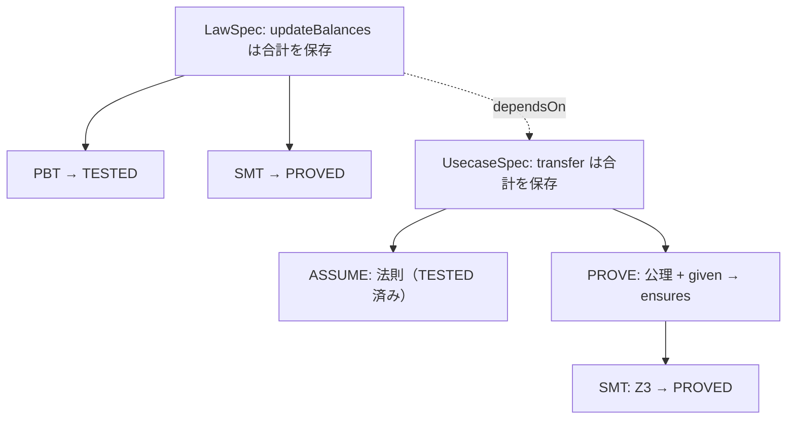
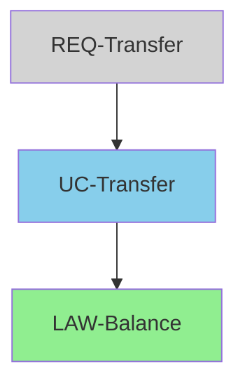

# seizu v3

## Formal Specification & Verification for TypeScript

<div class="pt-8 text-gray-400">
  PBT を超える。仕様を書き、証明し、検証する。
</div>

<div class="abs-br m-6 flex gap-2 text-sm opacity-50">
  星図 (seizu) — TypeScript Formal Spec Framework
</div>

<!--
seizu v3 のコンセプトと機能を紹介するプレゼンテーションです。
-->

---
layout: center
---

# Why seizu?

<div class="text-2xl text-gray-400 mb-8">
  PBT だけなら fast-check で十分。
</div>

---

# PBT の限界

テストは「実験」であり「証明」ではない

<div class="grid grid-cols-2 gap-8 mt-4">

<div>

### PBT（プロパティベーステスト）

- ランダム入力で性質を検証
- 反例を自動で発見・縮小
- **しかし有限回のサンプリング**
- 見つからなかった ≠ 存在しない

</div>

<div>

### 形式検証（SMT証明）

- 数学的に「常に成り立つ」を保証
- **反例が存在しないことを証明**
- 入力空間の全域をカバー
- 証明 = 数学的保証

</div>

</div>

<div class="mt-8 text-center text-xl">

seizu は **PROVED** と **TESTED** を区別し、依存グラフで伝播する

</div>

---

# seizu の核心

<div class="grid grid-cols-3 gap-6 mt-8">

<div class="border rounded-lg p-4 bg-green-50 dark:bg-green-900/20">

### SMT (Z3)
Spec の論理的健全性を **数学的に証明**

<div class="text-sm text-green-600 mt-2 font-bold">PROVED</div>

</div>

<div class="border rounded-lg p-4 bg-blue-50 dark:bg-blue-900/20">

### PBT (fast-check)
実装が Spec を **実験的に検証**

<div class="text-sm text-blue-600 mt-2 font-bold">TESTED</div>

</div>

<div class="border rounded-lg p-4 bg-purple-50 dark:bg-purple-900/20">

### Graph + Evidence
検証状態の **依存関係伝播** と可視化

<div class="text-sm text-purple-600 mt-2 font-bold">PROPAGATION</div>

</div>

</div>

<div class="mt-8 text-center text-gray-500">

この3つの組み合わせが、テストフレームワークとの決定的な違い

</div>

---

# Assume-Guarantee 検証

<div class="text-gray-400 mb-4">副作用モジュールも含めて証明可能にする仕組み</div>



<div class="mt-2 text-center bg-yellow-50 dark:bg-yellow-900/20 p-3 rounded text-sm">

実装本体の AST 解析は不要。**Spec の predicate のみ**を SMT エンコード

</div>

---
layout: section
---

# 3 つの Spec 型

---

# RequirementSpec

<div class="text-gray-400 mb-4">トレーサビリティのための上位層（検証ロジックなし）</div>

```ts {all|3-4|5|6-9|10|all}
const req = requirementSpec({
  id: 'REQ-Transfer',
  name: '送金要件',
  actors: ['buyer'],
  goal: '口座間で資金を移動する',
  given:     [{ id: 'auth',     text: 'ユーザーが認証済み' }],
  success:   [{ id: 'done',     text: '送金が完了し記録される' }],
  failure:   [{ id: 'no-funds', text: '残高不足で失敗' }],
  forbidden: [{ id: 'negative', text: '残高がマイナスにならない' }],
  dependsOn: ['UC-Transfer'],
});
```

<v-click>

<div class="mt-4 p-3 bg-gray-50 dark:bg-gray-800 rounded text-sm">

- 人間向けのメタデータ。実行可能な検証ロジックは持たない
- 下位 Spec への `dependsOn` でトレーサビリティを提供
- ドキュメント生成時に要件→実装の追跡が可能

</div>

</v-click>

---

# LawSpec

<div class="text-gray-400 mb-4">純粋関数の「常に成り立つべき性質」を宣言</div>

```ts {all|2-3|4|5-9|10-16|all}
const balanceLaw = lawSpec({
  id: 'LAW-BalanceConservation',
  name: '残高の合計は更新操作で変化しない',
  target: { module: './impl', export: 'updateBalances' },
  generators: {
    from:   fc.constantFrom('alice', 'bob'),
    to:     fc.constantFrom('alice', 'bob'),
    amount: fc.integer({ min: 1, max: 10000 }),
    state:  fc.constant({ /* 初期状態 */ }),
  },
  laws: [
    law(
      'conserve-total',
      '合計残高は操作の前後で不変',
      (args, result) => result.totalBalance === args.state.totalBalance,
    ),
  ],
  dependsOn: [],
});
```

---

# UsecaseSpec

<div class="text-gray-400 mb-4">バックエンド操作の事前条件・事後条件・エラー条件</div>

```ts {all|4|5|6-9|10-14|15-17|18-19}
const transferSpec = usecaseSpec({
  id: 'UC-Transfer',
  name: '口座間送金',
  target: { module: './impl', export: 'transfer' },
  classifyError: (error) => error.type,
  given: [
    given('positive-amount', '送金額は正',
      ({ input }) => input.amount > 0),
  ],
  ensures: [
    ensure('balance-preserved',
      '成功時に合計残高が保存される',
      ({ before, after, result }) =>
        result.ok ? before.totalBalance === after.totalBalance : true),
  ],
  errors: [
    errorClause('err-same', 'same_account', '同一口座への送金'),
  ],
  effects: [],
  dependsOn: ['LAW-BalanceConservation'],
});
```

---

# Clause ファクトリ一覧

<div class="mt-4">

| 関数 | 用途 | コンテキスト |
|------|------|-------------|
| `given(id, desc, fn)` | 事前条件 | `{ input, state }` |
| `ensure(id, desc, fn)` | 事後条件 | `{ before, after, input, result }` |
| `invariant(id, desc, fn)` | 不変条件 | `{ before, after, input, result }` |
| `errorClause(id, tag, desc, fn?)` | エラー条件 | `{ input, error, state }` |
| `law(id, desc, fn)` | 代数的法則 | `(args, result)` |
| `effect(id, facet, desc, fn)` | 副作用検証 | `(observed, ctx)` |

</div>

<v-click>

<div class="mt-4 text-sm text-gray-500">

全ての clause は `id` 必須。Obligation ID `${specId}:${kind}:${clauseId}` の一部になる

</div>

</v-click>

---
layout: section
---

# 依存グラフと検証の伝播

---

# RefinementGraph

<div class="grid grid-cols-2 gap-6">

<div>

```ts
import {
  RefinementGraph,
  generateObligations,
  propagateEvidence,
} from 'seizu/spec';

const graph = new RefinementGraph();
graph.addAll([
  balanceLaw,
  transferSpec,
  requirement,
]);

// バリデーション
const v = graph.validate();
// → 循環参照・未解決参照を検出

// Obligation 生成
const obls = graph.allSpecs()
  .flatMap(generateObligations);
```

</div>

<div>



<div class="text-sm mt-2">

<span class="text-green-500">緑</span> 全PROVED/TESTED　<span class="text-blue-500">青</span> 一部UNKNOWN　<span class="text-red-500">赤</span> REFUTED　<span class="text-gray-400">灰</span> 全UNKNOWN

</div>

</div>

</div>

---

# 検証状態の伝播

<div class="text-gray-400 mb-4">5段階のステータスが依存グラフを通じて伝播する</div>

<div class="grid grid-cols-2 gap-8">

<div>

| ステータス | 意味 |
|-----------|------|
| **PROVED** | SMT で数学的に証明済み |
| **TESTED** | PBT で実験的に確認済み |
| **REFUTED** | 反例が発見された |
| **UNKNOWN** | 未検証 |
| **ASSUMED** | 人間が手動で受理 |

</div>

<div>

<v-clicks>

**優先順位（高い順）:**

1. REFUTED → `refuted`
2. UNKNOWN → `unknown`
3. 依存先に問題 → `invalid`
4. ASSUMED → `assumed`
5. 全 PROVED/TESTED → `valid`

</v-clicks>

</div>

</div>

<v-click>

<div class="mt-4 p-3 bg-red-50 dark:bg-red-900/20 rounded text-center">

**REFUTED は最優先で伝播する。** 1つの法則の反例が、依存する全ユースケースを invalid にする

</div>

</v-click>

---

# 伝播の実例

```ts
// LAW が REFUTED → 依存する UC も REQ も invalid に
const results = new Map([
  ['LAW-Balance', {
    specId: 'LAW-Balance',
    obligations: [
      { obligationId: 'LAW-Balance:law:conserve', status: 'REFUTED' },
    ],
  }],
  ['UC-Transfer', {
    specId: 'UC-Transfer',
    obligations: [
      { obligationId: 'UC-Transfer:ensure:balance', status: 'TESTED' },
    ],
  }],
]);

const evidence = propagateEvidence(graph, results);
```

<v-click>

```
LAW-Balance:     refuted   ← 反例あり
UC-Transfer:     invalid   ← 依存先 (LAW) が refuted
REQ-Transfer:    invalid   ← 依存先 (UC) が invalid
```

</v-click>

---
layout: section
---

# CLI パイプライン

---

# compile → verify → doc

<div class="grid grid-cols-3 gap-4 mt-6">

<div class="border rounded-lg p-4">

### 1. compile

```bash
seizu compile
```

- Spec モジュール検出
- 依存グラフ構築
- **SMT 証明実行**
- `.seizu/` に artifact 出力

</div>

<div class="border rounded-lg p-4">

### 2. verify

```bash
seizu verify --specs
```

- **PBT で実装を検証**
- SMT 結果とマージ
- Evidence 伝播
- TESTED / REFUTED 判定

</div>

<div class="border rounded-lg p-4">

### 3. doc

```bash
seizu doc --specs
```

- Mermaid 依存グラフ
- Obligation テーブル
- PROVED/TESTED 可視化
- Markdown 出力

</div>

</div>

<v-click>

<div class="mt-6 text-center text-gray-500">

compile = Spec の健全性チェック　|　verify = 実装の適合性チェック

</div>

</v-click>

---

# verify 出力例

```bash {all|1-4|5-16|17}
seizu verify --specs

  残高保存法則 (LAW-BalanceConservation)
    ✓ law:conserve-total — TESTED
    ? smt:consistency — UNKNOWN
    propagation: unknown

  口座間送金 (UC-Transfer)
    ✓ given:positive-amount — TESTED
    ✓ given:different-accounts — TESTED
    ✓ ensure:balance-preserved — TESTED
    ✓ error:err-same — TESTED
    ✓ error:err-funds — TESTED
    ✓ runtime:no_throw — TESTED
    ? smt:consistency — UNKNOWN
    propagation: unknown

  3 specs, 12 obligations: 0 proved, 8 tested, 0 refuted, 4 unknown
```

---

# Obligation ID フォーマット

<div class="text-gray-400 mb-4">全ての Obligation は決定的なフォーマットの ID を持つ</div>

```
${specId}:given:${clauseId}             事前条件
${specId}:ensure:${clauseId}            事後条件
${specId}:invariant:${clauseId}         不変条件
${specId}:error:${clauseId}             エラー条件
${specId}:law:${clauseId}               代数的法則
${specId}:effect:${clauseId}:${facet}   副作用検証
${specId}:runtime:no_throw              ランタイム例外なし
${specId}:smt:consistency               SMT 整合性
${specId}:smt:error_completeness        SMT エラー完全性
${specId}:smt:refinement:${depSpecId}   SMT 精緻化
```

<v-click>

<div class="mt-4 p-3 bg-gray-50 dark:bg-gray-800 rounded text-sm">

ID は parseable で安定。CI/CD でのフィルタリング、レポート、差分追跡に利用可能

</div>

</v-click>

---
layout: section
---

# Self-Dogfooding

---

# seizu は自身を検証している

<div class="text-gray-400 mb-2 text-sm">seizu のコアロジックに対して formal spec を定義し、自身で検証</div>

<div class="text-sm">

| Spec | 検証対象 | 結果 |
|------|---------|------|
| `GraphTopologicalSort` | トポロジカルソートが依存順序を尊重 | TESTED |
| `GraphCycleDetection` | 循環検出の正確性 (3 laws) | TESTED |
| `GraphDependencySymmetry` | dependencies/dependants の対称性 | TESTED |
| `PropagationPriority` | 伝播の優先順位 (2 laws) | TESTED |
| `PropagationDepInvalid` | 依存先の REFUTED 伝播 | TESTED |
| `ObligationIdFormat` | Obligation ID のフォーマット (2 laws) | TESTED |
| `ObligationCount` | Obligation 数の正確性 | TESTED |

</div>

<div class="text-center mt-3 text-lg font-bold">

7 specs, 18 obligations, 11 TESTED, 0 REFUTED

</div>

---
layout: center
---

# まとめ

<div class="grid grid-cols-2 gap-8 mt-8 text-left">

<div>

### seizu が提供するもの

- **PROVED vs TESTED** の明確な区別
- **Assume-Guarantee** 検証
- 依存グラフによる **検証状態の伝播**
- Mermaid 依存グラフ + Obligation テーブルの **自動ドキュメント生成**
- `compile → verify → doc` の **CI/CD パイプライン**

</div>

<div>

### 始め方

```bash
# 仕様を書く
vim specs/my-spec.ts

# コンパイル（SMT証明）
seizu compile

# 検証（PBT）
seizu verify --specs

# ドキュメント生成
seizu doc --specs
```

</div>

</div>

---
layout: end
---

# Thank you

seizu (星図) v3 — Formal Specification & Verification for TypeScript

<div class="text-gray-400 mt-4">
  仕様を書き、証明し、検証する。
</div>
